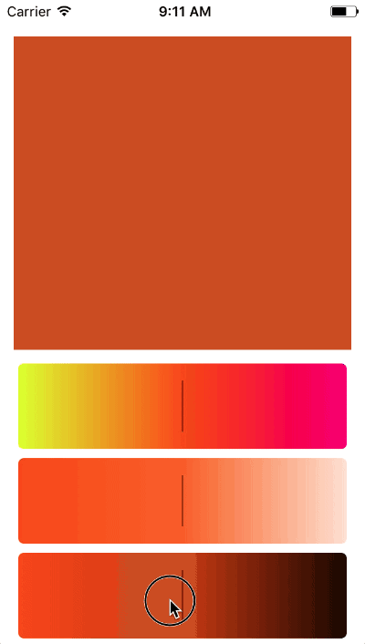

<p align="center">
  
</p>

<p align="center">
  
</p>

> Lightweight HSB color picker view in Swift.

## Install
### Carthage

Add the following to your Cartfile:
```
github "naturaln0va/RAScrollablePickerView"
```

The build the Cartfile:

```
carthage update --platform iOS
```

Then drag `Carthage/Build/iOS/RAScrollablePickerView.framework` into your Xcode project.

Finally add the import:

```
import RAScrollablePickerView
```

### Manual

Just drop `Framework/RAScrollablePickerView/RAScrollablePickerView/RAScrollablePickerView.swift` in your project.

## Usage

Then create 3 instances of the scrollable picker view and assign each a different type.
``` swift
huePicker.delegate = self

saturationPicker.delegate = self
saturationPicker.type = .saturation
saturationPicker.hueValueForPreview = huePicker.value

brightnessPicker.delegate = self
brightnessPicker.type = .brightness
brightnessPicker.hueValueForPreview = huePicker.value
```

Finally make sure the parent view/viewcontroller conforms to RAScrollablePickerViewDelegate and add the required valueChanged method.

``` swift
func valueChanged(_ value: CGFloat, type: PickerType) {
    switch(type) {
    case .hue:
        colorPreView.backgroundColor = UIColor(hue: value, saturation: saturationPicker.value, brightness: brightnessPicker.value, alpha: 1)
        saturationPicker.hueValueForPreview = value
        brightnessPicker.hueValueForPreview = value
    case .saturation:
        colorPreView.backgroundColor = UIColor(hue: huePicker.value, saturation: value, brightness: brightnessPicker.value, alpha: 1)
    case .brightness:
        colorPreView.backgroundColor = UIColor(hue: huePicker.value, saturation: saturationPicker.value, brightness: value, alpha: 1)
    }
}
```

## Contact

Feel free the reach out to me if you have an questions.

- https://twitter.com/naturaln0va
- https://ackermann.io
